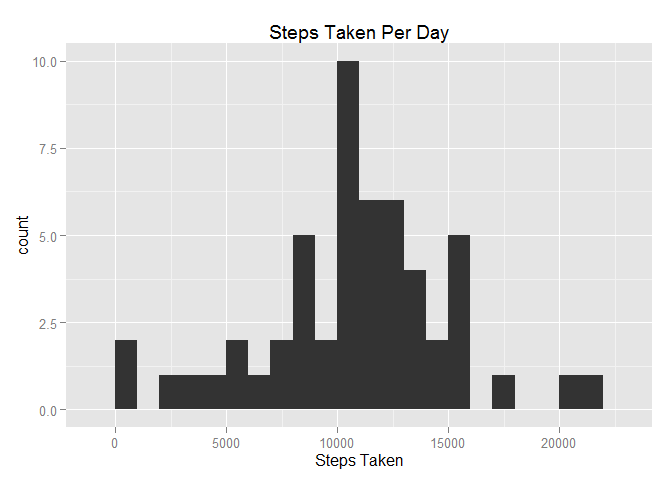
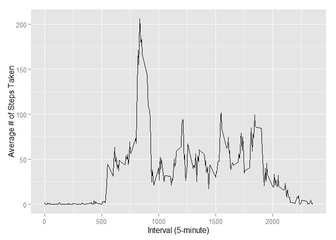
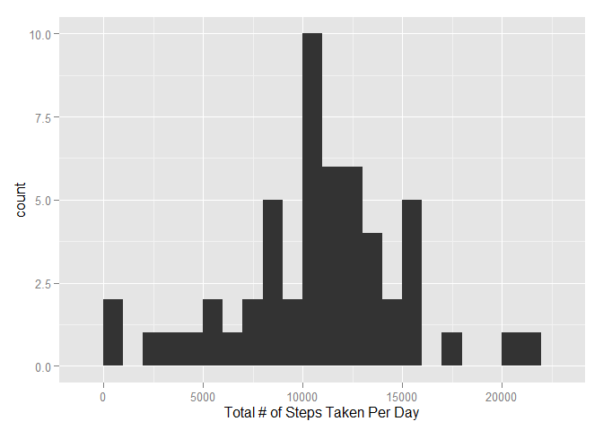
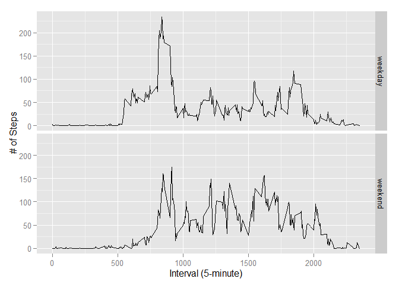

# Reproducible Research: Peer Assessment 1

## Loading and preprocessing the data

### Q1. Load the data

```r
library(ggplot2)
data <- read.table("activity.csv",header=TRUE,sep=",")
data <- na.omit(data)
```
### Q2. Process/transform the data (if necessary) into a format suitable for analysis

```r
steps <- tapply(data$steps,data$date,FUN=sum,na.rm=TRUE)
```
## What is mean total number of steps taken per day?

### Q1. Calculate the total number of steps taken per day

```r
stepsTotal <- sum(steps,na.rm=TRUE)
```
### Q2. Make a histogram of the toal number of steps taken per day

```r
qplot(steps,binwidth=1000,main="Steps Taken Per Day",xlab="Steps Taken")
```

 
### Q3. Calculate and report the mean and median of the total number of steps taken per day

```r
mean(steps,na.rm=TRUE)
```

```
## [1] 10766.19
```

```r
median(steps,na.rm=TRUE)
```

```
## [1] 10765
```
## What is the average daily activity pattern?

### Q1. Make a time series plot of the 5-minute interval and the average number of steps taken, averaged across all days

```r
avgSteps <- aggregate(x=list(steps=data$steps),by=list(interval=data$interval),FUN=mean,na.rm=TRUE)
ggplot(data=avgSteps,aes(x=interval,y=steps))+
  geom_line()+
  xlab("Interval (5-minute)")+
  ylab("Average # of Steps Taken")
```

 
### Q2. Which 5-minute interval, on average across all the days in the dataset, contains the maximum number of steps?

```r
avgSteps[which.max(avgSteps$steps),]
```

```
##     interval    steps
## 104      835 206.1698
```
## Inputing Missing Values

### Q1.

```r
sumMissing <- is.na(data$steps)
table(sumMissing)
```

```
## sumMissing
## FALSE 
## 15264
```
### Q2.

```r
fill <- function(steps,interval) {
  rep <- NA
  if(!is.na(steps))
    rep <- c(steps)
  else
    rep <- (avgSteps[avgSteps$interval == interval,"steps"])
  return(rep)
}
```
### Q3.

```r
fullData <- data
fullData$steps <- mapply(fill,fullData$steps,fullData$interval)
```
### Q4.

```r
stepsTotal <- tapply(fullData$steps,fullData$date,FUN=sum)
qplot(stepsTotal,binwidth=1000,xlab="Total # of Steps Taken Per Day")
```

 

```r
mean(stepsTotal,na.rm=TRUE)
```

```
## [1] 10766.19
```

```r
median(stepsTotal,na.rm=TRUE)
```

```
## [1] 10765
```
## Are there differences in activity patters between weekdays and weekends

### Q1.

```r
weekSort <- function(date) {
  day <- weekdays(date)
  if(day %in% c("Monday","Tuesday","Wednesday","Thursday","Friday"))
    return("weekday")
  else if (day %in% c("Saturday","Sunday"))
    return("weekend")
  else
    stop("invalid date")
}
fullData$date <- as.Date(fullData$date)
fullData$day <- sapply(fullData$date, FUN=weekSort)
```
### Q2.

```r
avgSteps <- aggregate(steps ~ interval + day, data=fullData, mean)
ggplot(avgSteps, aes(interval,steps))+ geom_line()+ facet_grid(day ~ .)+ xlab("Interval (5-minute)")+ ylab("# of Steps")
```

 
